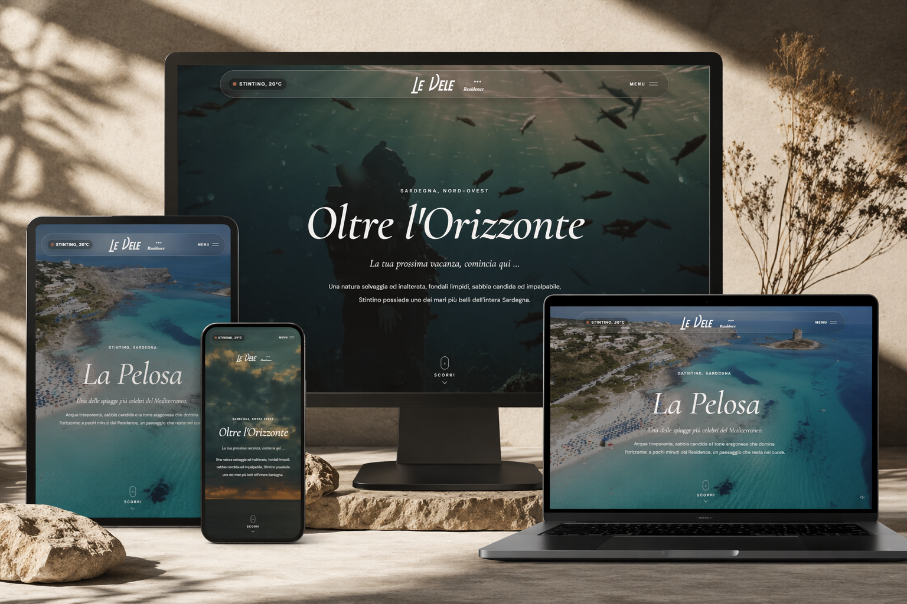

# React + Vite

# Le Vele Residence — Website

Website ufficiale per **Le Vele Residence (Stintino, Sardegna)**.  
Progetto sviluppato con focus su **esperienza immersiva, storytelling visivo e UI premium**.

🔗 Live preview: https://demo-le-vele-residence.vercel.app/

---

## Overview

Questo progetto nasce con un obiettivo chiaro:

> Trasformare una semplice presenza online in un’esperienza che faccia già “sentire” la vacanza.

Il sito utilizza **video, tipografia editoriale e animazioni leggere** per comunicare atmosfera, non solo informazioni.

---

## Features

- 🎥 Hero con video full-screen
- ✨ UI minimal ed elegante
- 📱 Design completamente responsive
- 🌊 Storytelling visivo (focus su immagini e location)
- ⚡ Performance ottimizzate per web
- 🎯 UX orientata alla conversione (prenotazione / contatto)

---

## Tech Stack

- HTML5
- CSS3 (layout moderno, responsive)
- JavaScript (vanilla)
- Deploy: Vercel

---

## Design Direction

Il progetto segue una direzione chiara:

- **Luxury minimal**
- **Editorial typography**
- **Visual-first approach**
- Palette naturale (mare, sabbia, luce)

L’interfaccia lascia spazio ai contenuti:  
le immagini fanno il lavoro, il design le supporta.

---

## Project Structure

/assets
/images
/videos
/index.html
/style.css
/script.js

---

## Performance & SEO

- Ottimizzazione immagini
- Lazy loading
- Struttura semantica HTML
- Base SEO migliorabile (in ottica produzione)

---

## Notes

Questo progetto è una **demo / redesign concept**, non il sito ufficiale online del residence.

---

## Author

**Michel Branche**  
Frontend Developer  

- GitHub: https://github.com/MichelBranche
- LinkedIn: https://www.linkedin.com/in/michel-branche-328501301/

---

## License

Questo progetto è a scopo dimostrativo.
